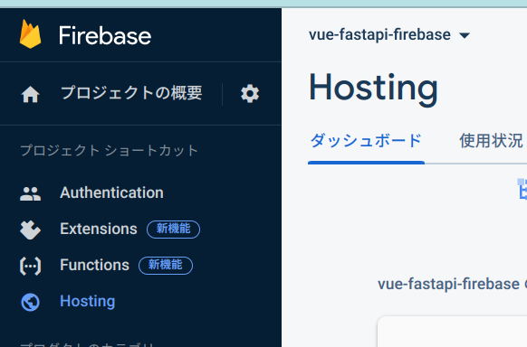

# vue-firebase-hosting-auth

This project includes the following features:
- Hosting this webpage on Firebase hosting
- Firebase authentification for controlling the access of the user-specific pages
- User-specific page contains:
  - User name
  - User logo
  - Log out button

## Project memo
Project setup:
```bash
cd vue-fastapi
npm -i axios vue-axios firebaseui firebase-tools
```

Run the development server
```bash
cd vue-fastapi
npm run dev
```

Deploy to the firebase-hosting

1. Write configurations in the vite project directory. Refer to [here](https://ja.vitejs.dev/guide/static-deploy.html#google-firebase)

For the `.firebaserc`, `<YOUR_FIREBASE_ID>` should be the project name of Firebase like `vue-fastapi-firebase`.
